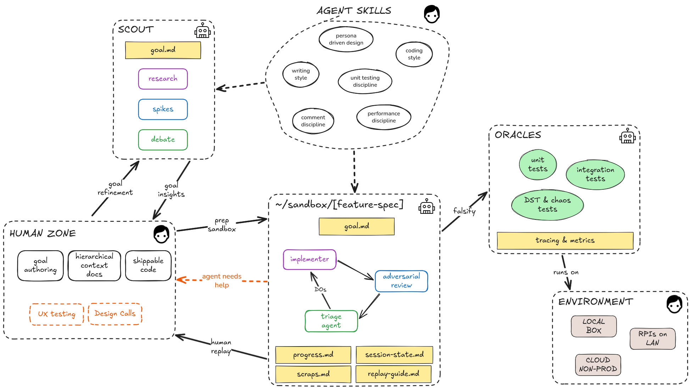

# build-method

The engineering method, as Claude Code skills. The things I would otherwise re-explain at the start of every build, written once and loaded everywhere.

Why does this exist? An agent left alone writes code that looks right, and looking right is not evidence. The method makes the agent prove its work empirically instead: a goal is validated by a scout before it costs anything, built autonomously in a sandbox under an adversarial loop where every phase must survive oracles and a fresh-context review, and folded back into the shippable code by a human who replays every decision. The grind goes to the agents. The understanding stays with the human.

This is the cross-cutting layer. It sits above any one repo. It does not know about any one repo's domain or wire contracts - those live in the repos that need them. This is how I build, regardless of the stack.



## The skills

The keystone is `adversarial-loop`; `method-overview` is the map. The rest feed the loop or check it.

| Skill | What it pins down |
|---|---|
| `method-overview` | The L0 map: human zone, scout, sandbox, replay - and which skill owns each stage. |
| `adversarial-loop` | The internal loop: the implementer proves each phase against oracles (unit/integration/DST/chaos, tracing, metrics), adversarial review, 4D triage, session/scraps.md, ends in session/replay-guide.md. |
| `scout` | Goal validation: research, spikes, and debate in a throwaway repo; goal insights and refinement back to the human zone. |
| `persona-driven-design` | Document a real persona before any code. Why the goals exist and who they serve. |
| `ux-verification` | Human-dictated journeys bound to oracle-authored tests; telemetry, tri-parity, and geometry assertions instead of vision models; the visual-residual ledger handed to replay. |
| `writing-style` | The prose rules for docs, comments, commits, and conversation. |
| `comment-discipline` | Kills verbose narration, comment drift, and dead-spec linkbacks. |
| `hierarchical-context-docs` | L0 to Lx architecture docs that disclose progressively instead of dumping the codebase. |
| `unit-testing-discipline` | Parameterized tests, helper extraction, named invariants, the mocking ladder. |
| `test-taxonomy` | Unit vs integration vs DST vs chaos - what each catches, when to reach. |
| `performance-discipline` | Performance as an invariant: benchmark, flamegraph, the per-decision cost choices. |
| `coding-style` | Data-oriented, low-state, library restraint. Per-language idioms and bans in `references/`. |

## Install

Inside of Claude Code run:

```
/plugin marketplace add utilitydelta/build-method
/plugin install build-method@build-method
```

Once installed, the skills load in every session regardless of which repo you launch from. No git-boundary problem, no global skills folder.

## Adjacent work

- [human-replay](https://github.com/utilitydelta/human-replay) - sandbox prep, replay-guide generation, and the VS Code replay extension. The method's prep and replay stages.
- [human-replay-vscode-extension](https://marketplace.visualstudio.com/items?itemName=UtilityDelta.human-replay) - make human replay fun, just hit `tab` and the magic happens.
- [debate-battle](https://github.com/utilitydelta/debate-battle) - the multi-agent debate engine the scout runs goals through.
- [react-mobx-mvvm](https://github.com/utilitydelta/react-mobx-mvvm) - my opinionated take at how to build front end with agents using MVVM.

## License

MIT. See [LICENSE](./LICENSE).
